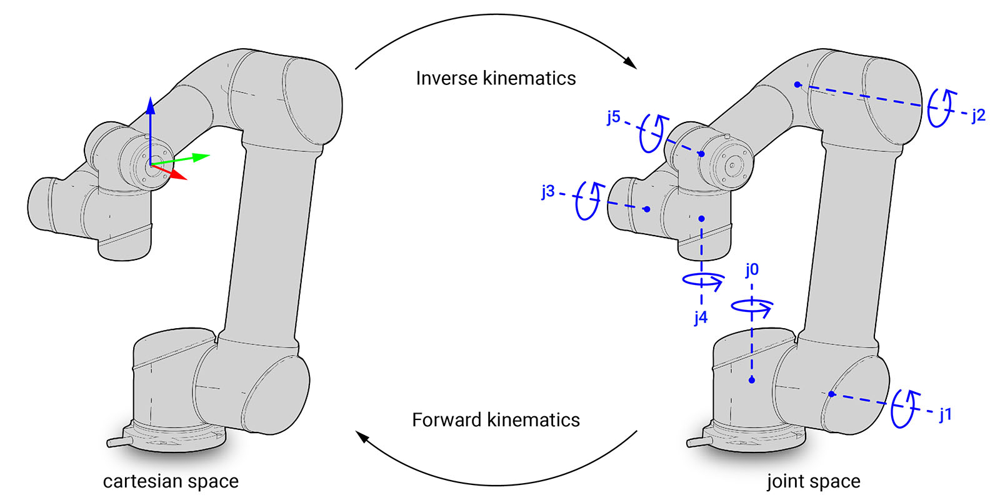

Kinematics is a branch of mathematics that studies the motion of points, bodies, or systems of bodies. It is concerned with positions and velocities. 

**Forward Kinematics** refers to the problem of computing the position of an end-effector in cartesian space from given joint angles. 

 gramaziokohler   - compas fab 

 

*Learn more about Kinematics at [QUT robot acadamy](https://robotacademy.net.au/masterclass/robotic-arms-and-forward-kinematics/?lesson=278).*