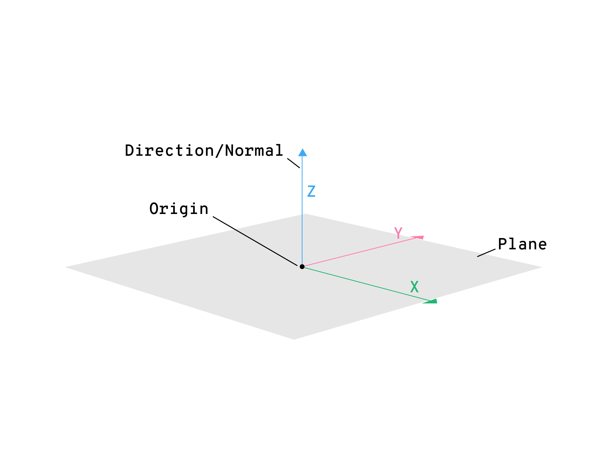

Flat surface (two-dimensional object in Euclidean space) that extends infinitely far.
In robotics planes are used to define position and orientation in space.

A plane can be described by:
- 3 points
- Origin and x, y vectors
- Origin and normal vector
